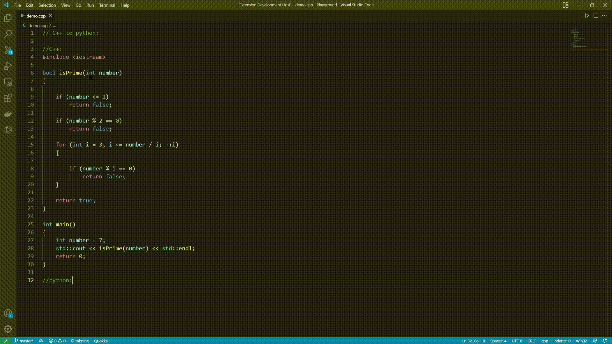
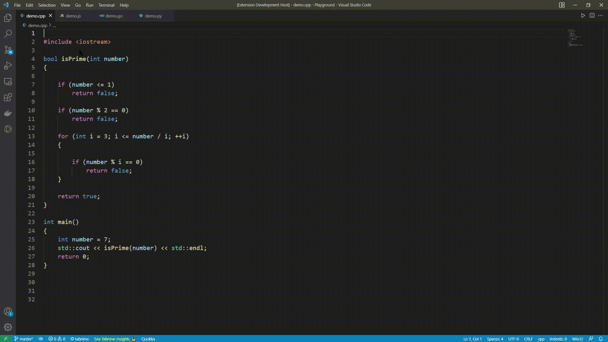

# VS Code Extension - Smart Automations

Your smart companion for your coding journey.

## Run Locally

Clone the project

```bash
  git clone https://link-to-project
```

Go to the project directory

```bash
  cd my-project
```

Install dependencies

```bash
  npm install
```

Open it in VS Code and start the server

```bash
  Press F5
```


## Features

- Allows for code collaboration between different programming languages. (Code conversion from one programming language to another).
- Writing programming code using instructions in any natural language(e.g. English, Hindi, etc..).
- Automatically generates documentation for all provided code functions and classes.
- Semantic search in any file.


## Demo

### Code conversion
- In first-line write from which language you want to Convert and to which language you want to Convert in. (Preferably commented)
- In the second line write the "From_Language_Name" followed by a colon (":"). (Preferably commented)
- From the third line onwards write your code.
- The last line will be "To_Language_Name" followed by a colon (":"). (Preferably commented)
- Now select the whole text and Open the Command Palette (Ctrl+Shift+P).
- Select `Intellectify: Convert code`
Format:
```bash
  "From_Language_Name" to "To_Language_Name"
  "From_Language_Name:"
   Your_Code
  "To_Language_Name:"
```


### Generate code from instructions
- Write proper step-wise instructions to get the desired result.
- Use any language for writing instructions, here I've shown two demos, one in English and one in Hindi.
- Now select the whole text and Open the Command Palette (Ctrl+Shift+P).
- Select `Intellectify: Write code`
.gif)
.gif)

### Generate documentation
- [imp.] Leave at least one empty line at the bottom of your selected text and do not include this empty line in your selection. (Else whole code will be commented out)
- Now select the required code snippets for its documentation and Open the Command Palette (Ctrl+Shift+P).
- Select `Intellectify: Generate documentation`



### Semantic search
- [imp.] Do not search in a file having more than 1800 tokens, search on a small file as this API have a limit for now hence request will get failed if the limit exceeds.
- Open any file and Open the Command Palette (Ctrl+Shift+P).
- Select `Intellectify: Do semantic search`, an input search box will appear.
- Search anything with logical sense and Press `Enter`.
- Whichever line is making most sense with your search will be get highlighted with viewpoint centered.

## Requirements

Open AI API Key - visit the [website](https://openai.com/api/) to get one.

### Extension settings
- Disable SSL Verification in your VS Code manually on a temporary basis in order to make this Extension run.
- Follow these steps to `Disable SSL Verification` (`"http.systemCertificates": false,`):
```bash
  1. Open user settings in VSCode.
  2. Now click on "Application",
  3. Now click on "Proxy".
  4. Uncheck "System Certificates".
```
## Environment Variables

To run this project, you will need to add the following environment variables to your .env file

`OPENAI_API`


## Release Notes

#### 1.0.0
Initial release


## Author

- [@Surya742](https://www.github.com/Surya742)

